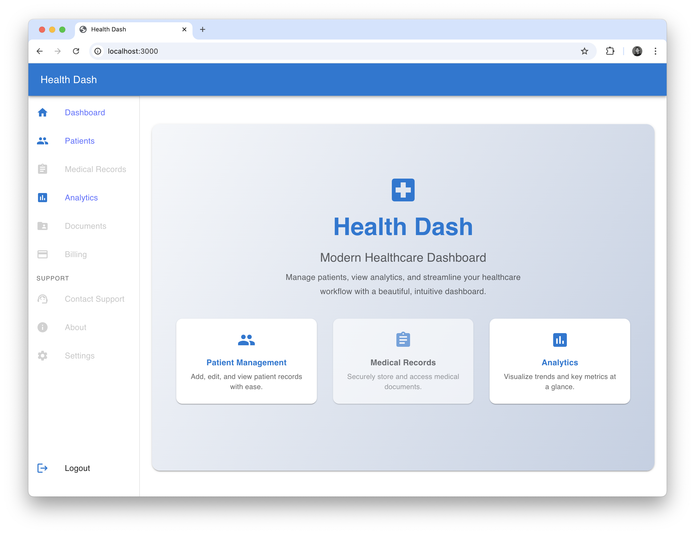
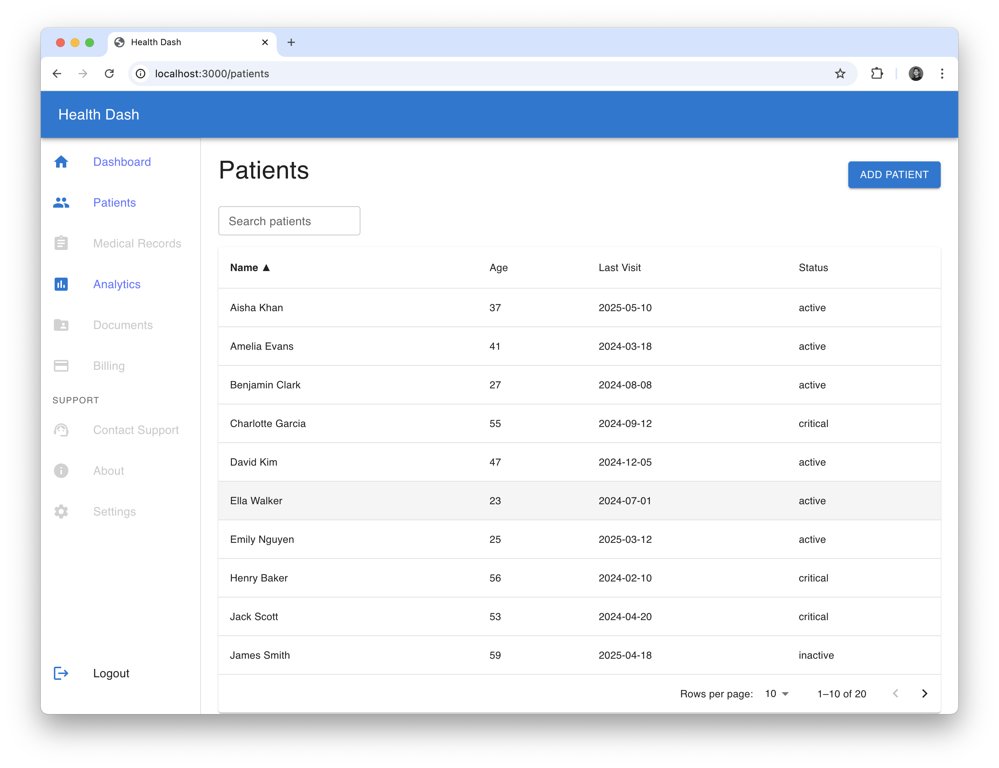
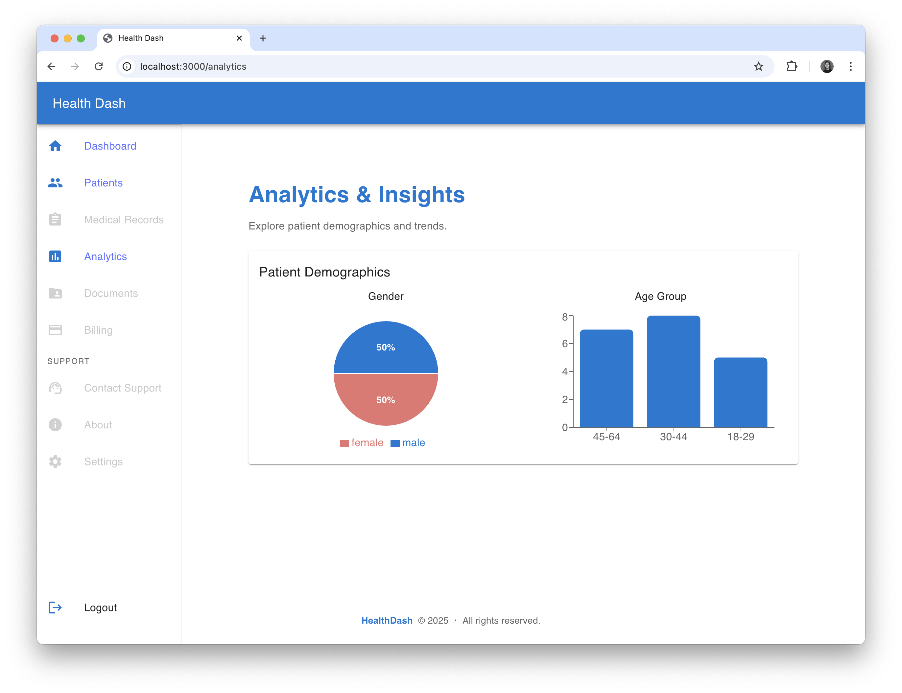

# HealthDash

A modern, scalable fullstack dashboard for patient management in a medical practice.

<div align="center">
	
	
	
	
</div>

## 🛠 Tech Stack

- **Frontend:** React + TypeScript + Vite
- **UI:** Material UI (MUI)
- **State Management:** Zustand
- **Routing:** React Router v6
- **Styling:** MUI CSS-in-JS
- **Testing:** Vitest, React Testing Library
- **Linting/Formatting:** ESLint, Prettier
- **Backend:** FastAPI (Python)
- **Containerization:** Docker, docker-compose

## ✨ Features

- Responsive dashboard layout (header, sidebar, main, footer)
- Patient list with search, sort, and pagination
- Analytics dashboard (demographics, trends)
- Routing for dashboard, patient list, patient details, and 404
- Mock patient data (15+ patients)
- Scalable folder structure for future growth

---

## 🚀 Getting Started

### Prerequisites

- Node.js 18+
- Python 3.10+
- Docker & docker-compose

## 🏃‍♂️ How to Run

You can run the frontend and backend separately (recommended for development), or together using Docker Compose (recommended for deployment/testing).

### 1. Local Development (Separate Servers)

**Frontend:**

```bash
cd healthdash
npm install
npm run dev
# App: http://localhost:3000
```

**Backend:**

```bash
cd backend
python3 -m venv .venv
source .venv/bin/activate
pip install -r requirements.txt
uvicorn main:app --reload --host 0.0.0.0 --port 8000
# API: http://localhost:8000
```

### 2. Docker Compose (All-in-One)

```bash
docker-compose up --build
# Frontend: http://localhost:3000
# Backend: http://localhost:8000
```

This method builds and runs both services in containers. Useful for testing production-like environments or deployment.

---

## 📁 Project Structure

- `/src/components` — Shared UI components
- `/src/features` — Feature modules (e.g., patients)
- `/src/layouts` — App layouts
- `/src/pages` — Route-level components
- `/src/store` — Zustand state management
- `/src/types` — TypeScript interfaces
- `/src/mocks` — Mock data
- `/backend` — FastAPI backend

---

## 🧠 Architectural Decisions

- Vite for fast builds and modern tooling
- Material UI for accessible, production-ready UI
- Zustand for simple, scalable state management
- React Router v6 for routing
- Docker for easy local setup

---

## 📄 License

MIT
